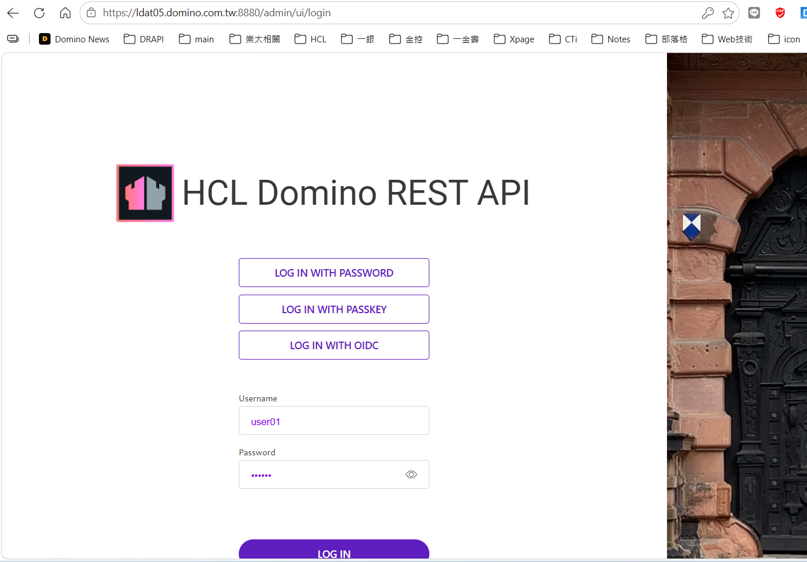

# Switching DRAPI to HTTPS + hostname

Move DRAPI from `http://127.0.0.1:8880` to `https://ldat05.domino.com.tw:8880`.
Goal: closer to a production setup (like an HTTPS IdP such as ADFS).

> Local environment: Domino 12.0.2, DRAPI v1.1.7, certificate = Let's Encrypt wildcard `*.domino.com.tw`.

---

## Key concept: a KYR is not consumed by DRAPI directly

- **Domino HTTP (443)** over HTTPS → uses KYR / certstore (the Domino HTTP task).
- **DRAPI (8880) is a separate server**; its TLS is configured independently and **does not accept `.kyr`**.
  Supported: **PEM (used here)**, PFX, JKS, or certstore.nsf.

So you need a **PEM (cert + key)** first, or put the cert into certstore.nsf. Here we use the existing `cert.pem` + `key.pem` from the infra team.

---

## Steps

### 1. Verify the certificate (cert/key pairing, validity, domain)
```bash
openssl x509 -in cert.pem -noout -subject -issuer -dates -ext subjectAltName
# Pairing check: same fingerprint = a matching pair
openssl x509 -in cert.pem -pubkey -noout | openssl sha256
openssl pkey -in key.pem  -pubout    | openssl sha256
```
Here: `CN=*.domino.com.tw`, signed by Let's Encrypt (browsers already trust it), cert.pem has 2 certs (server + intermediate), cert/key fingerprints match ✅.

### 2. Enable HTTPS for DRAPI — two ways (pick one)

#### Option A: PEM files
Put `cert.pem`, `key.pem` under the Domino data dir (e.g. `C:\HCL\Domino1202\Data\drapicerts\`),
and add `tls.json` in `keepconfig.d`:
```json
{
  "TLSType": "pem",
  "TLSFile": "C:/HCL/Domino1202/Data/drapicerts/key.pem",
  "PEMCert": "C:/HCL/Domino1202/Data/drapicerts/cert.pem"
}
```
- `TLSFile` = **private key**, `PEMCert` = **certificate chain**

#### Option B: managed by certstore.nsf (**verified, recommended**)
Cert/key never touch the filesystem — managed by Certificate Manager, and can auto-renew via ACME.
1. `load certmgr` to create `certstore.nsf` (if not present)
2. Package cert + key into **PKCS12 (use `-legacy`, otherwise Domino can't read OpenSSL 3's newer format)**:
   ```bash
   openssl pkcs12 -export -legacy -inkey key.pem -in cert.pem \
     -name "ldat05.domino.com.tw" -out drapi.p12 -passout pass:<p12-password>
   ```
3. In the Notes/Admin client open certstore.nsf → **TLS CREDENTIALS → By Host Name → Add TLS Credentials → Import TLS Credentials**
   - Format: **PKCS12**, File name: the .p12 above, Current password: the p12 password, New password: a strong protecting password
   - **Servers with access** must include your server (e.g. `LDAT05/TheNet`), then save
4. Change `keepconfig.d/tls.json` to:
   ```json
   { "TLSCertStore": true, "TLSCertStoreName": ["*.domino.com.tw"] }
   ```
   (`TLSCertStoreName` matches the Host Name in certstore; for a wildcard cert use `*.domino.com.tw`)

> Restart DRAPI (`tell restapi quit` / `load restapi`). Verify:
> `openssl s_client -connect 127.0.0.1:8880 -servername ldat05.domino.com.tw` should present that cert.
>
> ⚠️ Mind the inbound/outbound split: certstore **only handles DRAPI's own HTTPS (inbound)**;
> "DRAPI trusting an external IdP (outbound)" **does not use certstore** — use the JVM truststore — see `憑證信任重現與排查.md`.

### 3. Edit hosts (point the hostname to localhost)
`C:\Windows\System32\drivers\etc\hosts` (open as Administrator), add:
```
127.0.0.1   ldat05.domino.com.tw
```

### 4. Test HTTPS (not login yet)
Open `https://ldat05.domino.com.tw:8880/admin/ui/login` in the browser — expect 🔒 with no warning (Let's Encrypt is trusted).



> Note: over HTTPS the login page gains a **LOG IN WITH PASSKEY** button (WebAuthn requires HTTPS), so the layout shifts.

### 5. The origin changed → update these too (OIDC breaks otherwise)
- **Keycloak → keepadminui → Valid redirect URIs** — add:
  `https://ldat05.domino.com.tw:8880/admin/ui/*`
- **DRAPI CORS (`keepconfig.d/cors.json`)** — add the new origin:
  ```json
  "^https:\\/\\/ldat05\\.domino\\.com\\.tw:8880$": true
  ```
- `providerUrl` **stays the same** (the IdP is Keycloak, unrelated to DRAPI's own scheme).

### 6. Test OIDC login
Login page → LOG IN WITH OIDC → pick keycloak-drapi → LOG IN → done.


---

## Gotchas

| Symptom | Cause / fix |
|---------|-------------|
| Keycloak redirect URI "looks saved but doesn't take effect" | Only counts when you see the **"Client successfully updated"** toast |
| `We are sorry... Invalid parameter: redirect_uri` | keepadminui missing `https://<host>:8880/admin/ui/*` (or not saved) |
| HTTPS page fetch blocked (mixed content) | Here DRAPI(HTTPS)→Keycloak(HTTP) is a full-page redirect — **verified not blocked**; only front-end fetches would hit this |

> Reminder: Let's Encrypt certs expire in 90 days; after the infra team renews, update `drapicerts\` `cert.pem`/`key.pem` and restart DRAPI.
