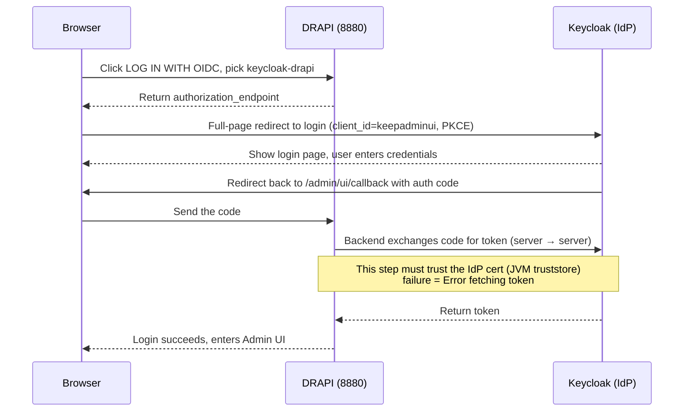
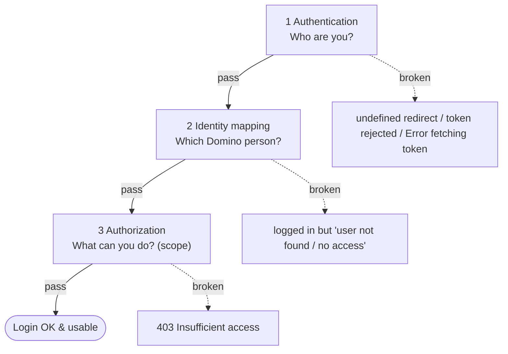

# DRAPI + Keycloak OIDC Login — Hands-on Notes

A full local reproduction of **OIDC login for the HCL Domino REST API (DRAPI)**, with every gotcha recorded along the way.
Using **Keycloak** as the IdP, the whole flow is run end-to-end in a local environment — a complete reference for OIDC config, identity mapping, certificate trust and certstore.

## Document index

| Document | Content |
|----------|---------|
| This file `README.md` | Step-by-step (Stages 1–6) + gotcha table + result |
| [`環境與架構.md`](環境與架構.md) | Test environment & network architecture diagram |
| [`HTTPS-主機名設定.md`](HTTPS-主機名設定.md) | Switching DRAPI to HTTPS + hostname (PEM cert, Keycloak redirect/CORS updates) |
| [`憑證信任重現與排查.md`](憑證信任重現與排查.md) | **Key finding**: reproducing `Error fetching token`, proving DRAPI outbound trust = **JVM cacerts** |
| [`certstore/README.md`](certstore/README.md) | certstore.nsf hands-on: works for DRAPI/Domino HTTP inbound, not for outbound; HTTP needs FQDN |

> 📐 See [Environment & Architecture](環境與架構.md) for the test setup and network diagram.

---

## Background: DRAPI's three OIDC modes

| Mode | When to use | Notes |
|------|-------------|-------|
| `jwt` | External provider where you only have the public key | |
| `oidc` | Standard OIDC provider (Keycloak, Entra ID…) | Needs clientId/clientSecret. **Used in this project** |
| `oidc-idpcat` | Domino 14+ `idpcat.nsf` | **Requires Domino 14**; not applicable here (12.0.2) |

> Takeaway: **Domino 12.0.2 can do OIDC via `oidc` mode** — Domino 14 is not required.

---

## Stage 1: Create a dedicated WSL environment

```powershell
wsl --version                                   # need >= 2.4.4 for --name
wsl --install -d Ubuntu-24.04 --name Keycloak-OIDC
```


---

## Stage 2: Install & start Keycloak (inside `Keycloak-OIDC`)

```bash
sudo apt update && sudo apt install -y openjdk-21-jdk
cd ~
KC_VERSION=$(curl -s https://api.github.com/repos/keycloak/keycloak/releases/latest | grep -oP '"tag_name": "\K[^"]+')
wget https://github.com/keycloak/keycloak/releases/download/${KC_VERSION}/keycloak-${KC_VERSION}.tar.gz
tar -xzf keycloak-${KC_VERSION}.tar.gz && cd keycloak-${KC_VERSION}
export KC_BOOTSTRAP_ADMIN_USERNAME=admin
export KC_BOOTSTRAP_ADMIN_PASSWORD=admin
bin/kc.sh start-dev
```

Verify: open **`http://localhost:8080`** in the Windows browser (⚠️ do not use `0.0.0.0:8080` — that's a bind address, not a connect address).


---

## Stage 3: Keycloak setup (admin console `localhost:8080`)

1. **Create Realm**: `drapi`
2. **Create Client Scope** `$DATA` (Type=Default, Include in token scope=On)
3. **Create Client** `keepadminui` (for the Admin UI):
   - Client authentication = **Off** (public / PKCE)
   - Standard flow = On
   - Valid redirect URIs: `http://127.0.0.1:8880/admin/ui/*`, `http://localhost:8880/admin/ui/*`
   - Web origins: `+`
4. **Create Client** `Domino` (for the server): Client authentication = **On**, copy the Client secret from Credentials
5. **Audience mapper**: on the `$DATA` scope add an Audience mapper, Included Custom Audience = `Domino`, Add to access token = On
6. **Create a test user** (later mapped to a real Domino user, see Stage 6)

> ⚠️ **providerUrl path trap**: Keycloak 26 realm paths have **no** `/auth` prefix (only old docs do).
> Correct: `http://<host>:8080/realms/drapi`. Verify by opening `…/realms/drapi/.well-known/openid-configuration` — it should return JSON.

---

## Stage 4: DRAPI config (`keepconfig.d`)

Put the file below in `keepconfig.d\` under the Domino data dir (here: `C:\HCL\Domino1202\Data\keepconfig.d\`), then `tell restapi quit` / `load restapi`.

```json
{
  "oidc": {
    "keycloak-drapi": {
      "active": true,
      "providerUrl": "http://<WSL_IP>:8080/realms/drapi",
      "clientId": "Domino",
      "clientSecret": "<copy from the Keycloak Domino client>",
      "userIdentifier": "email",
      "userIdentifierInLdapFormat": false,
      "adminui": { "active": true, "client_id": "keepadminui" }
    }
  }
}
```

### Key fields at a glance

| Field | Purpose |
|-------|---------|
| **`adminui`** | **The switch that makes this provider appear in the Admin UI login dropdown** (`active:true` + which `client_id`, usually `keepadminui`). **Without it, the dropdown won't show it** (see Gotcha 1). |
| `providerUrl` | The IdP address DRAPI's **backend must be able to reach** (fetch metadata, exchange token). Unreachable = provider fails to load and won't appear in the dropdown (see Gotcha 2 — don't use localhost). |
| `active` | Enable this provider. |
| `clientId` / `clientSecret` | Server-side (confidential) client, matching the one registered on the IdP. |
| `userIdentifier` / `userIdentifierInLdapFormat` | Which token claim maps to the Domino identity (see Stage 6). |

> In one line: **to see it in the login dropdown = the `adminui` block (lists it) + a reachable `providerUrl` (loads it)** — both are required.


### 🕳️ Gotcha 1: missing `adminui` block → redirect to `/admin/undefined`
Just defining an oidc provider does **not** make it appear as an Admin UI login option. The Admin UI reads `GET /api/v1/auth/idpList?configFor=adminui`; a provider must have the `adminui` block to be listed. Without it only the built-in `DRAPI` remains (whose `wellKnown` is the unresolvable `-build in-`), and the redirect becomes `http://127.0.0.1:8880/admin/undefined?...`.

### 🕳️ Gotcha 2 (the big one): providerUrl must not be `localhost`/`127.0.0.1`
When Keycloak is in WSL and DRAPI is on Windows:
- WSL2 localhost forwarding may only work over IPv6 (`localhost`/`::1`); IPv4 (`127.0.0.1`) fails to connect.
- **DRAPI is Java and resolves `localhost` to IPv4 `127.0.0.1` by default** → can't fetch metadata → provider fails to load → absent from idpList.

Fix: use the WSL real IP.

```powershell
wsl -d Keycloak-OIDC hostname -I        # e.g. 172.21.200.31
```

```bash
# Verify reachability from the DRAPI host (the same path DRAPI's Java takes)
curl http://<WSL_IP>:8080/realms/drapi/.well-known/openid-configuration   # should return 200
```

> 🔎 **Maps to real-world ADFS scenarios**: at heart it's the same "DRAPI server → IdP server-to-server connection/resolution" failing.
> On the remote side this is usually **a CA not imported into `certstore.nsf` / firewall / DNS**; here it's IPv4-vs-IPv6.
> Always start diagnosis from `curl <IdP>/.well-known` on the DRAPI host.

---

## Stage 5: OIDC login

Full flow (note the final "backend token exchange" is server→server and needs to trust the IdP cert):



On the login page click **LOG IN WITH OIDC**, pick **keycloak-drapi** in the dropdown, then LOG IN.


It redirects to Keycloak (URL `http://<WSL_IP>:8080/realms/drapi/...`, **no longer `/admin/undefined`**):


After login you reach the Admin UI. The 403 below is an **authorization-layer** issue (see Stage 6), **not an authentication failure**:


> 🕳️ **Gotcha 3**: if the dropdown doesn't appear / you picked the wrong one, the browser keeps a stale `oidc_config_url=-build in-` in localStorage,
> causing `Error initiating authorization request`. Clear that origin's localStorage and retry.

---

## Stage 6: Identity mapping + admin authorization

"Logged in and usable" is **three independent layers** — any one breaking looks like a "login failure":



| Layer | Question | How it connects |
|-------|----------|-----------------|
| **Authentication** | Who are you? | OIDC (`oidc` mode + external IdP). OIDC login failures usually stick here. |
| **Identity mapping** | Which Domino person? | token claim ↔ Domino Person, via `userIdentifier`. The user must exist in the Domino Directory. |
| **Authorization** | What can you do? | The token must carry enough DRAPI scopes. |

### 6-1 Identity mapping (email ↔ Internet address)
DRAPI `userIdentifier: "email"` → use the token's email to find the Domino person whose **Internet address** matches.
Just set the Keycloak user's email to the target Domino Person's Internet address.


### 6-2 Admin authorization (scope)
Admin features need the token to carry `$SETUP` and `keepconfigadmin`. Create matching client scopes in Keycloak (Default + Include in token scope).

> 🕳️ **Gotcha 4**: a Default-type client scope is only auto-attached to clients **created afterward** — it is **not** back-filled onto existing clients.
> `keepadminui` was created before these two scopes, so add them manually under `keepadminui` → Client scopes → Add.
> (`$DATA` worked from the start because it was created before keepadminui.)


Clear the browser localStorage, log in via OIDC again — the 403 is gone and admin features work:


---

## Gotcha summary

| # | Symptom | Cause / fix |
|---|---------|-------------|
| 1 | Redirect to `/admin/undefined` | keepconfig missing the `adminui` block |
| 2 | provider absent from idpList | providerUrl used localhost; switch to WSL IP (Java goes IPv4) |
| 3 | `Error initiating authorization request` | stale `oidc_config_url` in localStorage; clear and retry |
| 4 | Login OK but 403 `need $SETUP/keepconfigadmin` | scope not attached to the existing keepadminui client; add manually |
| — | (myth) trying to set CORS on the IdP | OIDC login is redirect + server-to-server, not subject to CORS; CORS belongs on the DRAPI side |

---

## Result

From zero to OIDC login success, identity mapping and admin authorization all working:


---

## References
- Official docs: <https://opensource.hcltechsw.com/Domino-rest-api/>
  - Configure DRAPI to use an OIDC provider / Configure Keycloak / Set up external IdP for Admin UI / Auth* reference
