# DRAPI + Keycloak OIDC 登入實作筆記

在本機完整重現 **HCL Domino REST API (DRAPI) 透過 OIDC 登入**的全套流程，並把每個踩雷點記錄下來。
以 **Keycloak** 當 IdP 在自己環境跑通一次，建立 OIDC 設定、身分對應、憑證信任與 certstore 的完整實作參考。

## 文件索引

| 文件 | 內容 |
|------|------|
| 本檔 `README.md` | 從零重現 OIDC 登入（階段一～六）＋踩雷總表 |
| [`HTTPS-主機名設定.md`](HTTPS-主機名設定.md) | DRAPI 改用 HTTPS + 主機名（PEM 憑證、Keycloak redirect/CORS 連動） |
| [`憑證信任重現與排查.md`](憑證信任重現與排查.md) | **重點**：重現 `Error fetching token`，證實 DRAPI 對外信任 = **JVM cacerts** |
| [`certstore/README.md`](certstore/README.md) | certstore.nsf 能耐實測：DRAPI/Domino HTTP inbound 可用、outbound 不行；HTTP 需 FQDN |

---

## 成果

從零到 OIDC 登入成功、身分對應、管理員授權全部跑通：


---

## 環境

| 項目 | 內容 |
|------|------|
| Domino server (DRAPI) | **本機 Windows**（非 WSL），`http://127.0.0.1:8880/`，**Domino 12.0.2**、DRAPI v1.1.7 |
| 瀏覽器 | 本機 Windows |
| IdP | **Keycloak 26**，裝在新建的 WSL Ubuntu distro `Keycloak-OIDC` |


**關鍵網路觀念**：WSL2 所有 distro 共用同一個輕量 VM 與 localhost。Windows 上的 DRAPI 與瀏覽器都可連到 WSL 裡的 Keycloak —— **但有個大坑（見下方階段四）**：`localhost` 在 IPv4/IPv6 行為不一致。

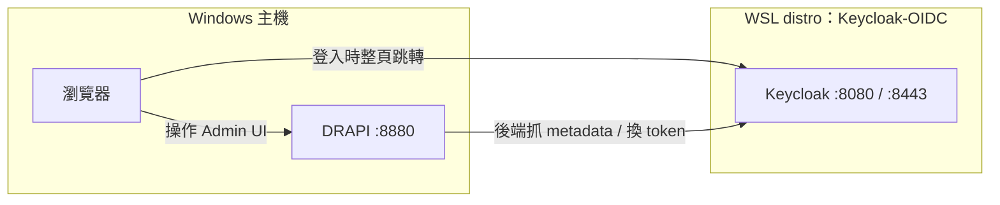

> ⚠️ `DRAPI → Keycloak` 這條（providerUrl）**必須用 WSL 實際 IP，不可用 localhost**（見階段四踩雷點 2）。

---

## 先備知識：DRAPI 的三種 OIDC 模式

| 模式 | 適用 | 備註 |
|------|------|------|
| `jwt` | 只拿得到公鑰的外部 provider | |
| `oidc` | 標準 OIDC provider（Keycloak、Entra ID…） | 需 clientId/clientSecret。**本專案用這個** |
| `oidc-idpcat` | Domino 14+ 的 `idpcat.nsf` | **需 Domino 14**；本機是 12.0.2 故不適用 |

> 結論：**Domino 12.0.2 用 `oidc` 模式可成功走 OIDC**，不需要 Domino 14。

---

## 階段一：建立專用 WSL 環境

```powershell
wsl --version                                   # 需 ≥ 2.4.4 才支援 --name
wsl --install -d Ubuntu-24.04 --name Keycloak-OIDC
```

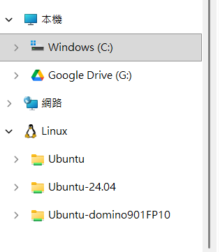

---

## 階段二：安裝並啟動 Keycloak（在 `Keycloak-OIDC` 內）

```bash
sudo apt update && sudo apt install -y openjdk-21-jdk
cd ~
KC_VERSION=$(curl -s https://api.github.com/repos/keycloak/keycloak/releases/latest | grep -oP '"tag_name": "\K[^"]+')
wget https://github.com/keycloak/keycloak/releases/download/${KC_VERSION}/keycloak-${KC_VERSION}.tar.gz
tar -xzf keycloak-${KC_VERSION}.tar.gz && cd keycloak-${KC_VERSION}
export KC_BOOTSTRAP_ADMIN_USERNAME=admin
export KC_BOOTSTRAP_ADMIN_PASSWORD=admin
bin/kc.sh start-dev
```

驗收：Windows 瀏覽器開 **`http://localhost:8080`**（⚠️ 不要用 `0.0.0.0:8080`，那是綁定位址不是連線位址）。

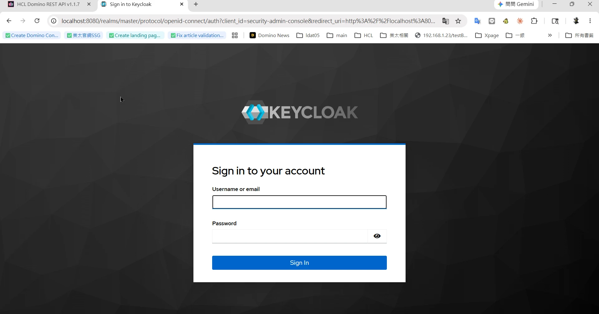

---

## 階段三：Keycloak 設定（管理台 `localhost:8080`）

1. **建立 Realm**：`drapi`
2. **建立 Client Scope** `$DATA`（Type=Default、Include in token scope=On）
3. **建立 Client** `keepadminui`（Admin UI 用）：
   - Client authentication = **Off**（公開 / PKCE）
   - Standard flow = On
   - Valid redirect URIs：`http://127.0.0.1:8880/admin/ui/*`、`http://localhost:8880/admin/ui/*`
   - Web origins：`+`
4. **建立 Client** `Domino`（server 用）：Client authentication = **On**，記下 Credentials 的 Client secret
5. **Audience mapper**：在 `$DATA` scope 加 Audience mapper，Included Custom Audience = `Domino`，Add to access token = On
6. **建立測試使用者**（後續用真實 Domino 使用者對應，見階段六）

> ⚠️ **providerUrl 路徑陷阱**：Keycloak 26 的 realm 路徑**沒有** `/auth` 前綴（舊版文件才有）。
> 正確：`http://<host>:8080/realms/drapi`。驗證：開 `…/realms/drapi/.well-known/openid-configuration` 應回 JSON。

---

## 階段四：DRAPI 設定（`keepconfig.d`）

把下列檔案放到 Domino data 下的 `keepconfig.d\`（本機路徑：`C:\HCL\Domino1202\Data\keepconfig.d\`），改完 `tell restapi quit` / `load restapi`。

```json
{
  "oidc": {
    "keycloak-drapi": {
      "active": true,
      "providerUrl": "http://<WSL_IP>:8080/realms/drapi",
      "clientId": "Domino",
      "clientSecret": "<從 Keycloak Domino client 複製>",
      "userIdentifier": "email",
      "userIdentifierInLdapFormat": false,
      "adminui": { "active": true, "client_id": "keepadminui" }
    }
  }
}
```

### 關鍵欄位速覽

| 欄位 | 作用 |
|------|------|
| **`adminui`** | **讓此 provider 出現在 Admin UI 登入下拉的開關**（`active:true` + 用哪個 `client_id`，通常 `keepadminui`）。**沒有這段，登入下拉就看不到它**（見踩雷點 1）。 |
| `providerUrl` | DRAPI **後端要連得到**的 IdP 位址（抓 metadata、換 token）。連不到 provider 就載入失敗、也不會出現在下拉（見踩雷點 2，不能用 localhost）。 |
| `active` | 啟用此 provider。 |
| `clientId` / `clientSecret` | server 端（機密）client，對應 IdP 上註冊的那組。 |
| `userIdentifier` / `userIdentifierInLdapFormat` | 用 token 的哪個 claim 對應到 Domino 身分（見階段六）。 |

> 一句話：**要在登入下拉看到它 = `adminui` 區塊（列出它）＋ `providerUrl` 連得到（載入成功）**，兩者缺一不可。

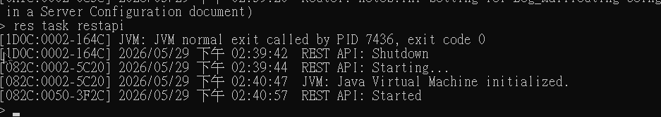

### 🕳️ 踩雷點 1：缺 `adminui` 區塊 → 導向 `/admin/undefined`
只定義 oidc provider **不會**讓它出現在 Admin UI 登入選項。Admin UI 讀 `GET /api/v1/auth/idpList?configFor=adminui` 取清單，provider 必須有 `adminui` 區塊才會被列出。缺了就只剩內建 `DRAPI`（其 `wellKnown` 是無法解析的 `-build in-`），導向變成 `http://127.0.0.1:8880/admin/undefined?...`。

### 🕳️ 踩雷點 2（最大坑）：providerUrl 不能用 `localhost`/`127.0.0.1`
Keycloak 在 WSL、DRAPI 在 Windows 時：
- WSL2 的 localhost 轉發可能只在 IPv6 (`localhost`/`::1`) 生效，IPv4 (`127.0.0.1`) 連不到。
- **DRAPI 是 Java，預設把 `localhost` 解析成 IPv4 `127.0.0.1`** → 抓不到 metadata → provider 載入失敗 → 不出現在 idpList。

解法：用 WSL 實際 IP。

```powershell
wsl -d Keycloak-OIDC hostname -I        # 例：172.21.200.31
```

```bash
# 在 DRAPI 主機驗證可達（這條等同 DRAPI 的 Java 會走的路）
curl http://<WSL_IP>:8080/realms/drapi/.well-known/openid-configuration   # 應回 200
```

> 🔎 **與 ADFS 等正式場景對應**：本質都是「DRAPI server → IdP 的 server-to-server 連線/解析」打不通。
> 對方端常見是**憑證未匯入 `certstore.nsf` / 防火牆 / DNS**；本機端是 IPv4-IPv6。
> 診斷都從「在 DRAPI 主機 `curl <IdP>/.well-known`」開始。

---

## 階段五：OIDC 登入

完整流程（注意最後「後端換 token」那段是 server→server，需信任 IdP 憑證）：

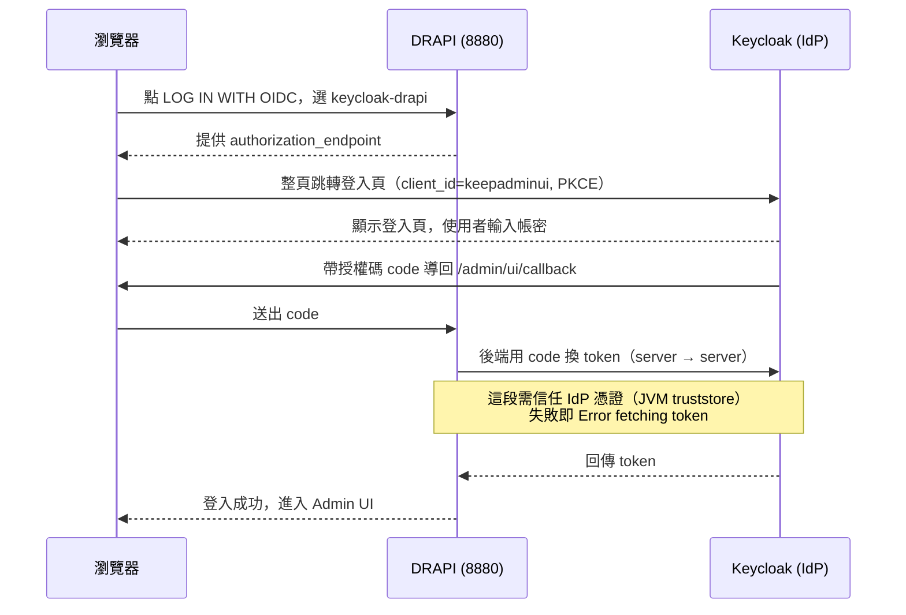

登入頁點 **LOG IN WITH OIDC**，下拉選 **keycloak-drapi**，按 LOG IN。

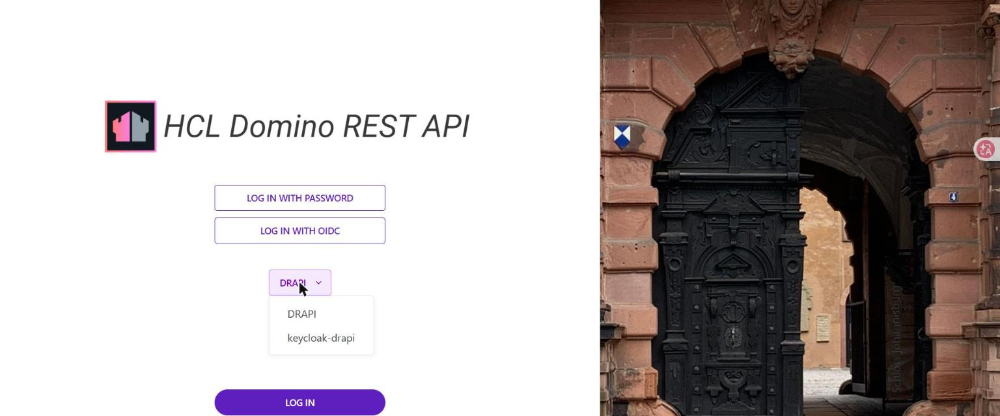

導向 Keycloak（網址為 `http://<WSL_IP>:8080/realms/drapi/...`，**不再是 `/admin/undefined`**）：

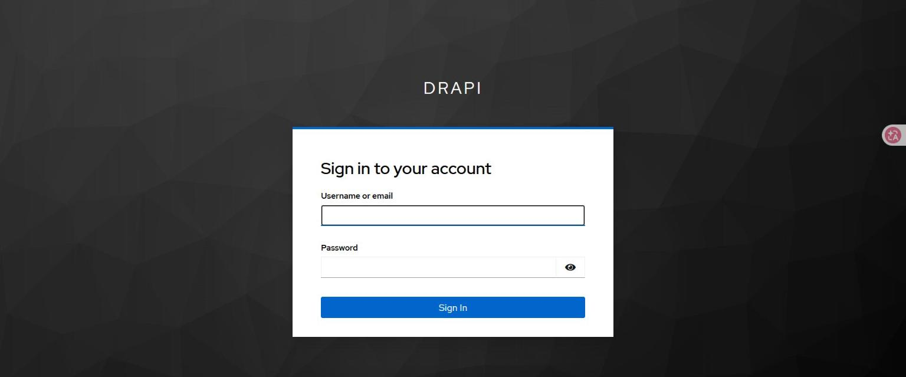

登入後成功進入 Admin UI。若出現下圖 403，屬於**授權層**（見階段六），**不是認證失敗**：

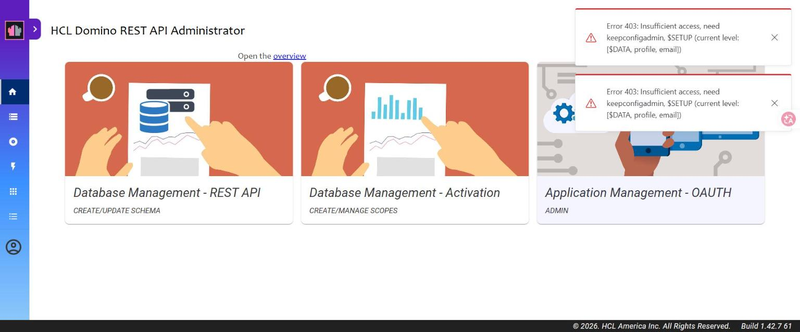

> 🕳️ **踩雷點 3**：若登入頁下拉沒出現/選錯，瀏覽器 localStorage 會殘留壞掉的 `oidc_config_url=-build in-`，
> 導致 `Error initiating authorization request`。清掉該網域 localStorage 重來即可。

---

## 階段六：身分對應 + 管理員授權

「登入成功且能用」是**三個獨立的層**，任一層斷掉都像「登入失敗」：

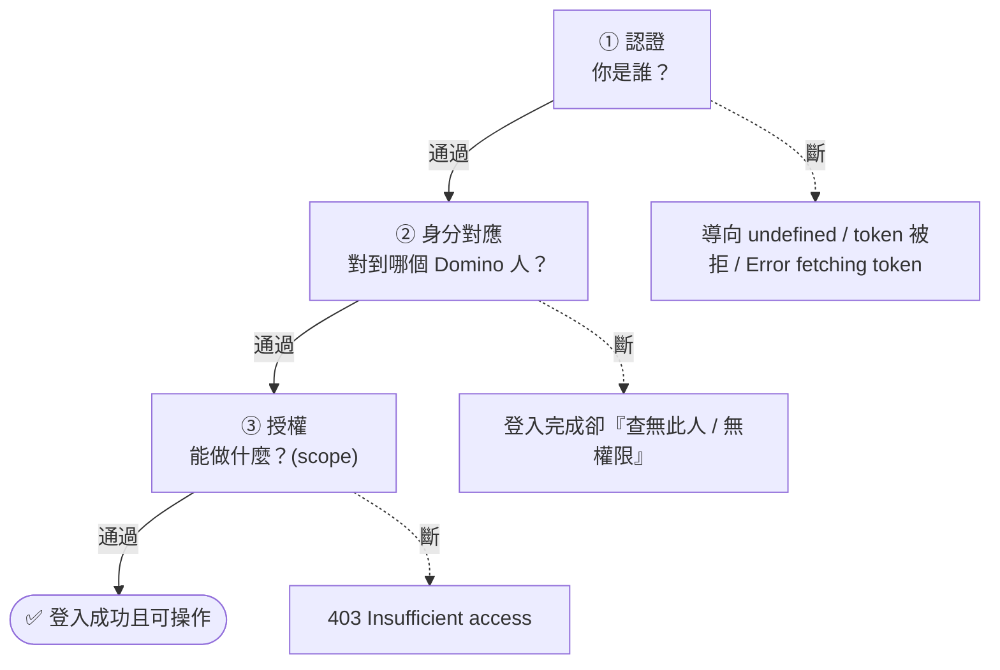

| 層 | 問題 | 連接方式 |
|----|------|---------|
| **認證** | 你是誰？ | OIDC（`oidc` 模式 + 外部 IdP）。OIDC 登入失敗常卡在這層。 |
| **身分對應** | 對應到哪個 Domino 人？ | token claim ↔ Domino Person，靠 `userIdentifier`。使用者須存在於 Domino Directory。 |
| **授權** | 能做什麼？ | token 要帶足夠 DRAPI scope。 |

### 6-1 身分對應（email ↔ Internet 位址）
DRAPI `userIdentifier: "email"` → 用 token 的 email 去 Domino Directory 找 **Internet 位址**相符的人。
把 Keycloak 使用者 email 設成目標 Domino Person 的 Internet 位址即可。

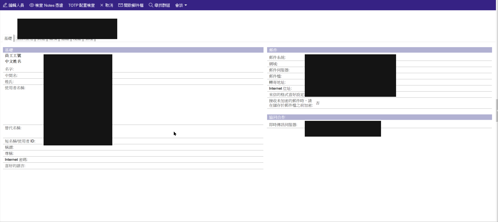
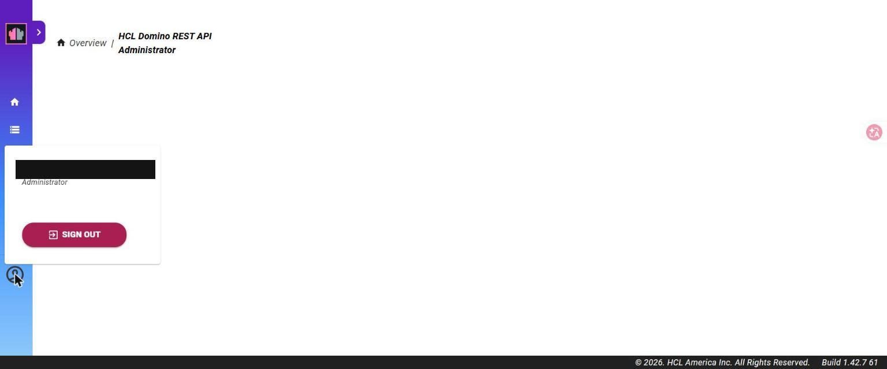

### 6-2 管理員授權（scope）
管理功能需 token 帶 `$SETUP`、`keepconfigadmin`。在 Keycloak 建立同名 client scope（Default + Include in token scope）。

> 🕳️ **踩雷點 4**：Default 型 client scope 只會自動掛到「之後新建」的 client，**不會回頭補到既有 client**。
> `keepadminui` 比這兩個 scope 早建，所以要手動到 `keepadminui` → Client scopes → Add 進去。
> （`$DATA` 一開始就有效，是因為它在 keepadminui 之前建立。）

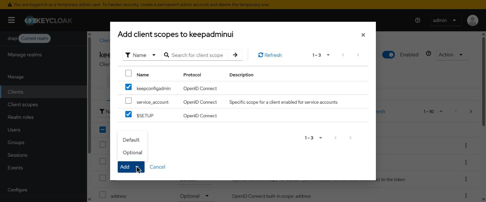

清掉瀏覽器 localStorage、重新 OIDC 登入後，403 消失、管理功能可用：

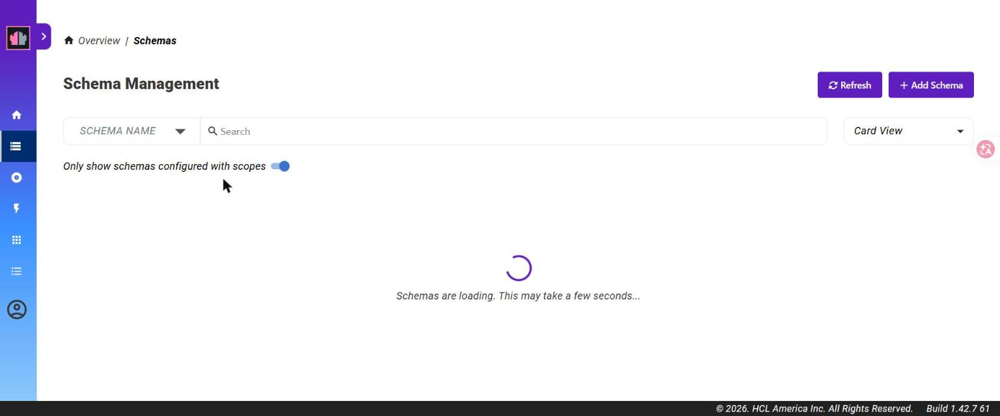

---

## 踩雷點總表

| # | 症狀 | 原因 / 解法 |
|---|------|------------|
| 1 | 導向 `/admin/undefined` | keepconfig 缺 `adminui` 區塊 |
| 2 | provider 不出現在 idpList | providerUrl 用了 localhost；改 WSL IP（Java 走 IPv4） |
| 3 | `Error initiating authorization request` | localStorage 殘留壞掉的 `oidc_config_url`；清掉重來 |
| 4 | 登入成功但 403 `need $SETUP/keepconfigadmin` | scope 沒掛到既有 client keepadminui；手動加 |
| — | （誤區）想在 IdP 設 CORS | OIDC 登入是 redirect + server 對 server，不受 CORS 管；CORS 設在 DRAPI 端 |

---

## 參考
- 原廠文件：<https://opensource.hcltechsw.com/Domino-rest-api/>
  - Configure DRAPI to use an OIDC provider / Configure Keycloak / Set up external IdP for Admin UI / Auth* 驗證參考
