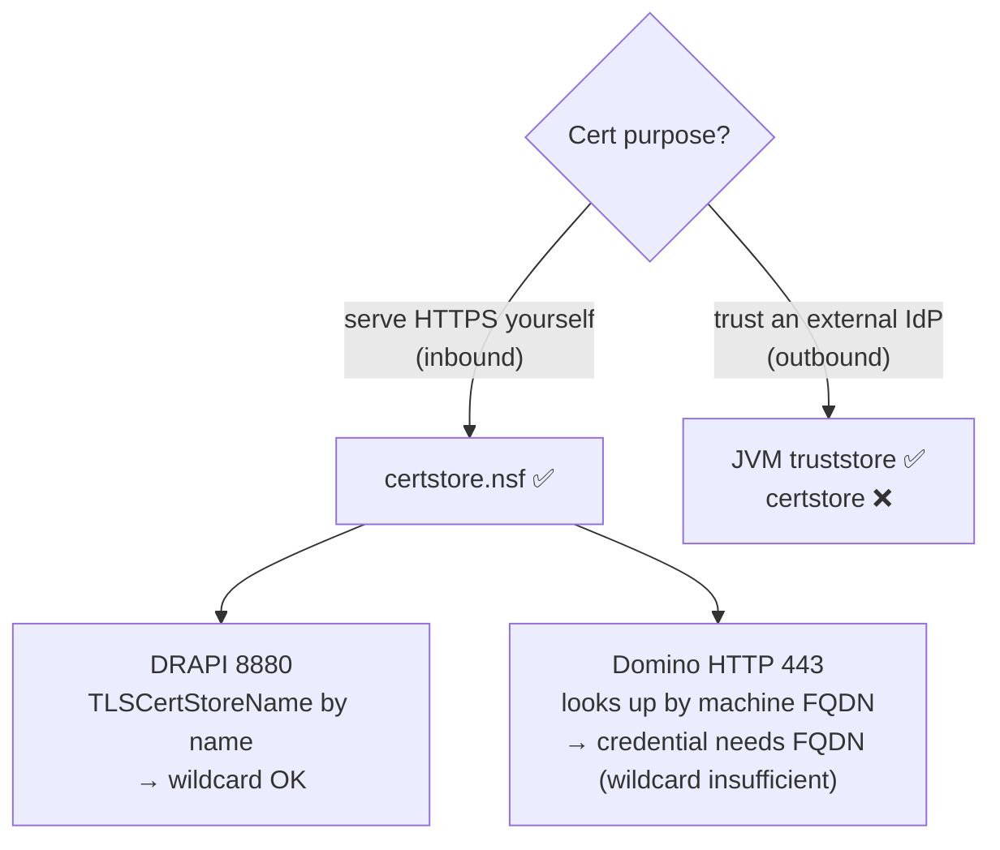

# certstore.nsf integration: hands-on

> Goal: clarify whether Domino 12's Certificate Manager (`certstore.nsf`) can replace the
> traditional cert files (`.pem` / `.kyr`) for **DRAPI** and for **Domino's own HTTP**, and whether a wildcard cert is enough.
> Environment: Domino 12.0.2, DRAPI v1.1.7, certificate = Let's Encrypt `*.domino.com.tw`.

---

## Conclusion in one table (all hands-on tested)

| Aspect | Use case | certstore usable? | Key condition |
|--------|----------|:---:|------|
| **DRAPI inbound** | DRAPI serving HTTPS itself (8880) | ✅ | tls.json `TLSCertStore` + `TLSCertStoreName` **by name**; wildcard `*.domino.com.tw` works |
| **Domino HTTP inbound** | Domino web HTTPS (443) | ✅ | the credential's **Host names must include the machine's FQDN** (`ldat05.domino.com.tw`); **wildcard alone is not enough** |
| **DRAPI outbound** | trusting an external IdP (ADFS/Keycloak) | ❌ | does not read certstore; only the **JVM truststore** (see `../憑證信任重現與排查.md`) |



**In one line:**
- inbound (you are the server) → certstore works;
- outbound (you trust someone else) → only the JVM truststore.
- And the two inbound paths look things up differently: **DRAPI is "you name it"** (wildcard works), **Domino HTTP "takes the FQDN and searches"** (needs the FQDN).

---

## Test 1: DRAPI inbound (8880) ✅

`keepconfig.d/tls.json`:
```json
{ "TLSCertStore": true, "TLSCertStoreName": ["*.domino.com.tw"] }
```
- Import cert + private key into certstore's TLS Credentials via PKCS12 (`openssl pkcs12 -export -legacy ...`).
- Because we **name** `*.domino.com.tw` directly, the wildcard cert matches → HTTPS works (`openssl s_client` confirms it presents `*.domino.com.tw`).
- See `../HTTPS-主機名設定.md` Option B for details.

## Test 2: Domino HTTP inbound (443) ✅ (with a condition)

The Server document (non-Internet-Sites) ports TLS config was originally bound to `keyfile.kyr`. The test:

1. Only the wildcard `*.domino.com.tw` in certstore, kyr removed → **443 handshake fails** (certstore didn't take over).
2. Add **`ldat05.domino.com.tw` (FQDN) to that credential's Host names**, remove kyr → **443 works**, presents `*.domino.com.tw`.

→ Conclusion: **Domino HTTP looks up certstore by the machine's FQDN**; the credential must carry the **FQDN** as a Host name.
HTTP's lookup does not auto-expand/match a wildcard name.

> Contrast: DRAPI **explicitly names** which Host name it wants in tls.json, so the wildcard is enough.

## Test 3: DRAPI outbound (trusting an IdP) ❌

Put the IdP's CA only into certstore's **Trusted Root**, remove it from the JVM cacerts, restart → DRAPI **still doesn't trust it** (the provider disappears from idpList).
→ DRAPI goes outbound via JSSE and reads only the **JVM truststore**; certstore's Trusted Root feeds the Domino C engine's TLS cache.
(Full walkthrough in `../憑證信任重現與排查.md`.)

---

## Files in this folder

| File | Description |
|------|-------------|
| `keyfile.kyr` | **Backup of Domino HTTP's original keyring** (contains the private key). Moved out of `C:\HCL\Domino1202\Data\`. |
| `keyfile.sth` | The password stash file for the above. |

> ⚠️ `keyfile.kyr/.sth` contain a private key, are gitignored — do not leak.

### Current state
- Both Domino HTTP (443) and DRAPI (8880) are **now served by certstore.nsf**; there's no `keyfile.kyr` in the Domino data dir anymore.
- The Server document's "TLS key file name" field is **cleared (left blank)** → Domino HTTP fetches the cert from certstore by the machine's FQDN, working fine.

> 📌 Clarification: in an earlier test "clearing the field → 443 failed" — that was because **certstore only had the wildcard `*.domino.com.tw` then, with no FQDN added yet**.
> Once the credential's Host names include the FQDN (`ldat05.domino.com.tw`), **leaving the field blank is fine** and certstore takes over — cleaner than keeping a dead `keyfile.kyr` string.

### To roll back to kyr (fallback if certstore misbehaves)
1. Copy this folder's `keyfile.kyr`, `keyfile.sth` back to `C:\HCL\Domino1202\Data\`
2. `tell http restart`

---

## Mnemonic

> **"Cert for being a server yourself" → certstore (inbound); "trusting someone else" → JVM truststore (outbound).**
> Two certstore inbound paths: **DRAPI you name it (wildcard OK), Domino HTTP takes the FQDN and searches (needs FQDN).**
