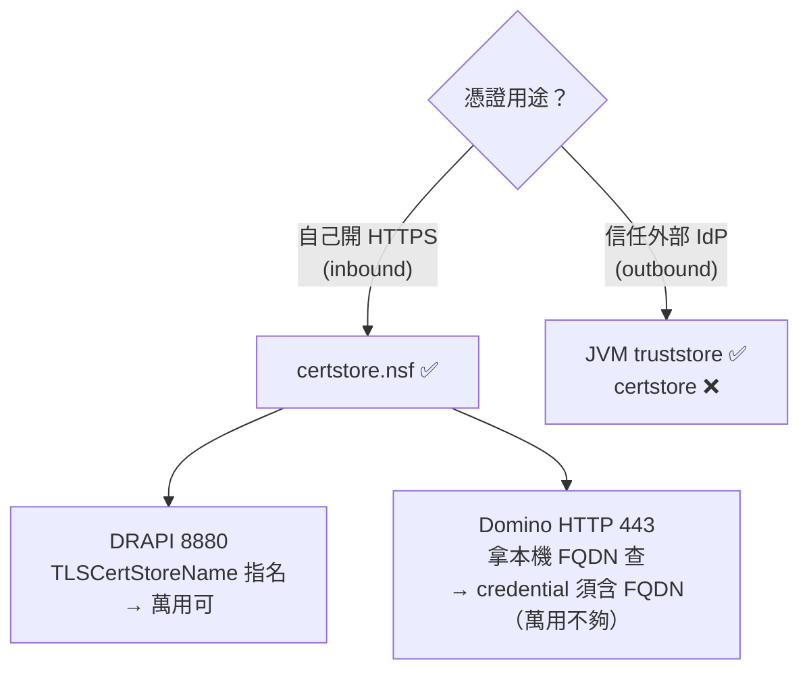

# certstore.nsf 整合實測

> 目的：釐清 Domino 12 的 Certificate Manager（`certstore.nsf`）在 **DRAPI** 與 **Domino 自身 HTTP** 上，
> 各自能不能取代傳統的憑證檔（`.pem` / `.kyr`），以及萬用憑證夠不夠用。
> 環境：Domino 12.0.2、DRAPI v1.1.7、憑證 Let's Encrypt `*.domino.com.tw`。

---

## 一張表看結論（皆親手實測）

| 面向 | 用途 | certstore 可用？ | 關鍵條件 |
|------|------|:---:|------|
| **DRAPI inbound** | DRAPI 自己開 HTTPS (8880) | ✅ | tls.json `TLSCertStore` + `TLSCertStoreName` **指名**；萬用 `*.domino.com.tw` 即可 |
| **Domino HTTP inbound** | Domino web HTTPS (443) | ✅ | credential 的 **Host names 必須含本機 FQDN**（`ldat05.domino.com.tw`）；**只有萬用不夠** |
| **DRAPI outbound** | 信任外部 IdP（ADFS/Keycloak） | ❌ | 不讀 certstore，只吃 **JVM truststore**（見 `../憑證信任重現與排查.md`） |



**一句話：**
- inbound（自己當 server）→ certstore 可以；
- outbound（信任別人）→ 只能 JVM truststore。
- 而 inbound 兩者查法不同：**DRAPI 是「你指名」**（吃萬用）、**Domino HTTP 是「它拿 FQDN 找」**（要 FQDN）。

---

## 實測 1：DRAPI inbound（8880）✅

`keepconfig.d/tls.json`：
```json
{ "TLSCertStore": true, "TLSCertStoreName": ["*.domino.com.tw"] }
```
- 把憑證+私鑰用 PKCS12（`openssl pkcs12 -export -legacy ...`）匯入 certstore 的 TLS Credentials。
- 因為**直接指名** `*.domino.com.tw`，萬用憑證就對得到 → HTTPS 正常（`openssl s_client` 驗證送出 `*.domino.com.tw`）。
- 詳見 `../HTTPS-主機名設定.md` 方式 B。

## 實測 2：Domino HTTP inbound（443）✅（但有條件）

Server document（非 Internet Sites）ports 的 TLS 設定，原本綁 `keyfile.kyr`。實測過程：

1. 只有萬用 `*.domino.com.tw` 在 certstore、移走 kyr → **443 握手失敗**（certstore 沒接手）。
2. 在該 credential 的 **Host names 加上 `ldat05.domino.com.tw`（FQDN）**、移走 kyr → **443 正常**，送出 `*.domino.com.tw`。

→ 結論：**Domino HTTP 用本機 FQDN 去 certstore 查**，credential 必須有 **FQDN** 這個 Host name；
萬用名稱 HTTP 的查找不會自動展開比對。

> 對照：DRAPI 因為在 tls.json **明確指名**要哪個 Host name，所以萬用就夠。

## 實測 3：DRAPI outbound（信任 IdP）❌

把 IdP 的 CA 只放進 certstore 的 **Trusted Root**、從 JVM cacerts 移除、重啟 → DRAPI **仍不信任**（provider 從 idpList 消失）。
→ DRAPI 對外走 JSSE，只讀 **JVM truststore**；certstore 的 Trusted Root 是給 Domino C 引擎的 TLS 快取用的。
（完整過程見 `../憑證信任重現與排查.md`。）

---

## 本資料夾檔案

| 檔案 | 說明 |
|------|------|
| `keyfile.kyr` | **Domino HTTP 原本的 keyring 備份**（含私鑰）。已從 `C:\HCL\Domino1202\Data\` 移出。 |
| `keyfile.sth` | 上者的密碼 stash 檔。 |

> ⚠️ `keyfile.kyr/.sth` 含私鑰，已 gitignore，勿外流。

### 目前狀態
- Domino HTTP(443) 與 DRAPI(8880) **都改由 certstore.nsf 供憑證**，Domino data 目錄已無 `keyfile.kyr`。
- server document 的「TLS 金鑰檔名」欄位**已清空**（留空）→ Domino HTTP 直接以本機 FQDN 從 certstore 取憑證，運作正常。

> 📌 補充澄清：稍早測試時「清空欄位 → 443 失敗」，是因為**那時 certstore 只有萬用 `*.domino.com.tw`、還沒加 FQDN**。
> 一旦 credential 的 Host names 含 FQDN（`ldat05.domino.com.tw`），**欄位留空即可**，certstore 就接手——比留著失效的 `keyfile.kyr` 字串更乾淨。

### 萬一要還原成 kyr（certstore 出問題時的退路）
1. 把本資料夾的 `keyfile.kyr`、`keyfile.sth` 複製回 `C:\HCL\Domino1202\Data\`
2. `tell http restart`

---

## 重點記法

> **「自己當 server 的憑證」→ certstore（inbound）；「信任別人」→ JVM truststore（outbound）。**
> certstore inbound 兩條路：**DRAPI 你指名（吃萬用）、Domino HTTP 它拿 FQDN 找（要 FQDN）。**
