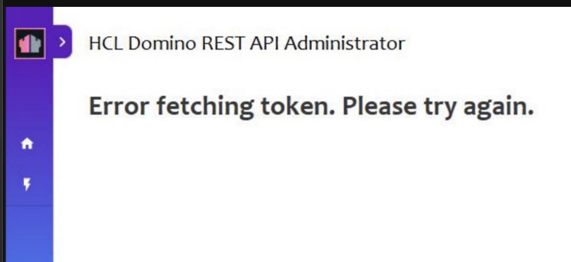
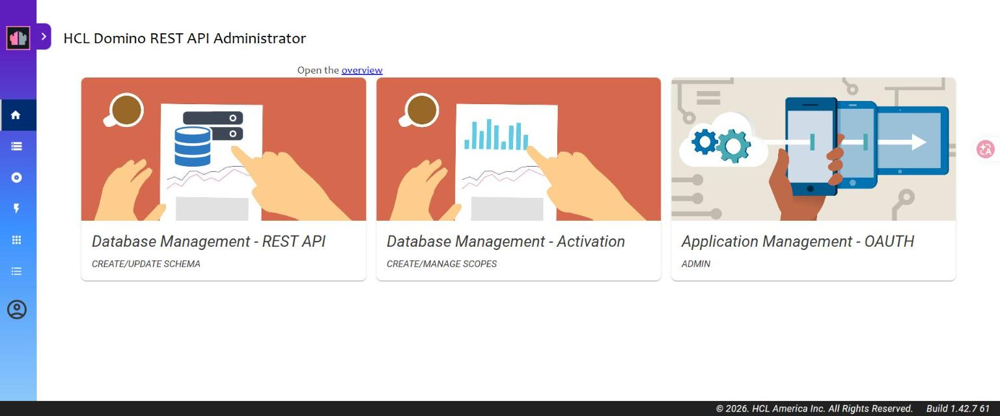

# DRAPI OIDC 憑證信任問題：重現與排查

> 核心發現：**DRAPI(Java) 信任外部 IdP 憑證，看的是它自己的 JVM truststore
> （`<Domino>\jvm\lib\security\cacerts`），不是 certstore.nsf、不是 Windows 憑證store、也不是 IdP 送的鏈。**

## 背景

情境：DRAPI 串 **外部 IdP（此處以 ADFS 為例，HTTPS）**，在 IdP 打完密碼、導回 DRAPI 後出現
**`Error fetching token. Please try again.`**



為了確認根因，本機用 **自簽憑證的 HTTPS Keycloak** 重現了同一類「DRAPI 不信任 IdP 憑證」的問題。

---

## 關鍵觀念：兩層信任，分屬不同步驟

| 信任層 | 何時用到 | 失敗症狀 |
|--------|---------|---------|
| **瀏覽器**信任 IdP | 前端跳轉去 IdP、前端抓 metadata | 跳轉被擋 / `Error initiating authorization request` |
| **DRAPI(Java)** 信任 IdP | 後端抓 metadata、**換 token**、抓 JWKS | provider 載入不了 / **`Error fetching token`** |

- 使用者能「到 ADFS 密碼頁」→ **瀏覽器層 OK**（公司機器信任 ADFS）。
- 但回來後 `Error fetching token` → **DRAPI(Java) 層不信任** ← 這才是要修的。

---

## 重現步驟（本機 Keycloak）

### 1. 讓 Keycloak 改用 HTTPS + 自簽憑證
在 Keycloak 主機（WSL）：
```bash
ip=$(hostname -I | awk '{print $1}')
openssl req -x509 -newkey rsa:2048 -nodes -keyout kc-key.pem -out kc-cert.pem \
  -days 825 -subj "/CN=keycloak-test" -addext "subjectAltName=IP:$ip"
bin/kc.sh start-dev \
  --https-certificate-file=$HOME/kc-cert.pem \
  --https-certificate-key-file=$HOME/kc-key.pem
```

### 2. 證明「不被信任」（重現使用者 PowerShell 那個現象）
從 DRAPI 主機測：
```
curl   https://<keycloak>:8443/realms/drapi/.well-known/openid-configuration  → HTTP 000（失敗，不被信任）
curl -k https://<keycloak>:8443/realms/drapi/.well-known/openid-configuration  → HTTP 200（略過驗證才過）
```
> 這正對應使用者「PowerShell curl 失敗、curl.exe 卻可以」——**不同工具用不同信任機制**，會誤導。

### 3. DRAPI 指向 HTTPS Keycloak → 重現失敗
把 `keepconfig.d` 的 `providerUrl` 改成 `https://<keycloak>:8443/realms/drapi`，重啟 DRAPI。
查 `…/api/v1/auth/idpList?configFor=adminui`：
- **provider 從清單消失**（只剩內建 DRAPI）→ DRAPI 啟動載入時抓不到 https metadata（Java 不信任）。
- 若硬登入則卡在 token 交換 → 等同使用者的 `Error fetching token`。

---

## 修法（本機實測有效）

### A.（關鍵）把 IdP 的 CA 匯入 DRAPI 的 JVM cacerts
```bash
# 用 Domino 自帶的 keytool，匯入到 DRAPI 跑的那個 JVM 的 cacerts（預設密碼 changeit）
"<Domino>\jvm\bin\keytool" -import -trustcacerts -alias keycloak-test \
  -file kc-cert.pem \
  -keystore "<Domino>\jvm\lib\security\cacerts" -storepass changeit -noprompt
```
重啟 DRAPI → `keycloak-drapi` **立刻回到 idpList**（帶 https wellKnown）→ 證實 DRAPI 用的就是這個 truststore。

> 自簽憑證它自己就是根；正式環境（如 ADFS 內部 CA）要把 **根 + 中繼都匯入**（alias 取不同名）。

### B. 瀏覽器層（自簽才需要；使用者通常已具備）
自簽憑證瀏覽器也不信任 → 匯入作業系統信任根：
```
certutil -addstore -user -f Root kc-cert.pem
```
> 使用者的 ADFS 是公司機器本來就信任的，所以這層通常 OK——他們只缺 A。

### 結果：完整登入成功 ✅


---

## certstore.nsf 行不行？（實測：**不行**）

為了確認「能不能不碰 cacerts、改用 certstore.nsf」，做了隔離實測：

1. `load certmgr` 建立 `certstore.nsf`
2. 在 **Trusted Roots** 匯入同一張自簽憑證（Paste Certificate → 整段含 `BEGIN/END` → Submit Request → Issued）
3. **把該憑證從 JVM cacerts 移除**（`keytool -delete`），只留 certstore 這條
4. 重啟 DRAPI → 查 idpList

**結果：`keycloak-drapi` 沒有出現 → DRAPI 不信任。**

結論：**DRAPI 的對外 OIDC 連線不讀 certstore.nsf 的 Trusted Root**。
原因：DRAPI(Java) 對外走 **JSSE**，預設只讀 **JVM truststore**；certstore.nsf 的 Trusted Root 是給
**Domino C 引擎的 TLS 快取**（HTTP task、idpcat）用的，KEEP/DRAPI 的 outbound 不走那條。
（注意：DRAPI 自己的 **HTTPS inbound** 可用 certstore 的 `TLSCertStore`，那是另一回事，別混淆。）

> ⚠️ 升級提醒：直接改 shipped `jvm\lib\security\cacerts`，在 Domino/JVM 升級時會被**覆蓋**。
> 正式環境建議改用**自管 truststore 檔 + `-Djavax.net.ssl.trustStore=...`**（升級不會掉），
> 或改完 cacerts 後在升級流程裡重做。

---

## 常見「加了中繼卻沒效」的原因

最可能是下列之一：

1. **加錯地方**：加到 certstore.nsf / Windows / ADFS 端，但 **DRAPI 只認 JVM cacerts**。← 頭號嫌疑
2. **只加中繼、沒加根**：keytool 的信任錨是**根 CA**；缺根，PKIX 仍無法建立路徑。
3. **加錯 cacerts / 沒重啟**：不是 DRAPI 跑的那個 JVM，或被 `-Djavax.net.ssl.trustStore` 指到別處；或匯入後沒重啟。

### 排查步驟
```
# 1) 看真正錯誤（notes.ini 加 DEBUG_OIDCLogin=1 重啟後登入）
#    PKIX / unable to find valid certification path → 憑證信任（往下）
#    invalid_client / 401                          → 換成 client secret 問題

# 2) 看 ADFS 實際送出哪些憑證（確認鏈、跟你匯入的對得上）
"<Domino>\jvm\bin\keytool" -printcert -sslserver <ADFS主機>:443

# 3) 把 ADFS 的「根 + 中繼」匯入 DRAPI 的 JVM cacerts，重啟
"<Domino>\jvm\bin\keytool" -import -trustcacerts -alias adfs-root \
  -file adfs-root.cer -keystore "<Domino>\jvm\lib\security\cacerts" -storepass changeit
```

> 措辭提醒：我們在「Domino 12.0.2 + DRAPI 1.1.7」**實測 JVM cacerts 確定有效**。
> 因此最穩的建議是「確認 ADFS 的 CA（根+中繼）在 **DRAPI 的 JVM truststore** 裡，並重啟」。

---

## 一句話總結

> 使用者能到密碼頁但 `Error fetching token` = 瀏覽器信任 ADFS、但 **DRAPI(Java) 不信任**。
> 修法是把 **ADFS 的根+中繼 CA 匯入 DRAPI 的 JVM cacerts** 並重啟——別只丟 certstore/Windows。
