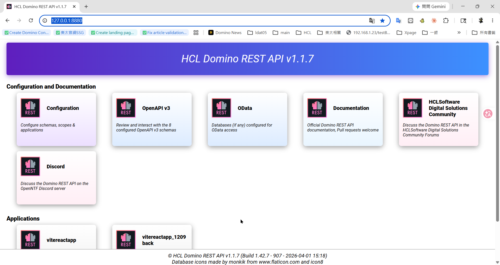
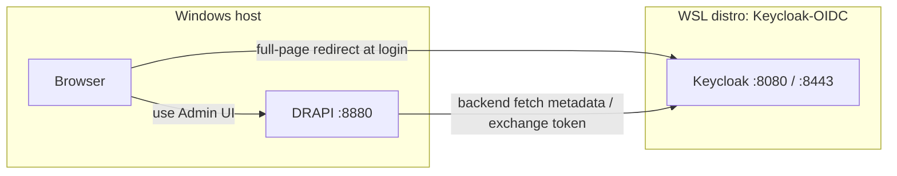

# Environment & Architecture

## Environment

| Item | Details |
|------|---------|
| Domino server (DRAPI) | **Local Windows** (not WSL), `http://127.0.0.1:8880/`, **Domino 12.0.2**, DRAPI v1.1.7 |
| Browser | Local Windows |
| IdP | **Keycloak 26**, in a newly created WSL Ubuntu distro `Keycloak-OIDC` |

## Architecture & networking

**Key networking note**: all WSL2 distros share one lightweight VM and localhost. The DRAPI and browser on Windows can both reach Keycloak in WSL — **but there's a big trap**: `localhost` behaves inconsistently across IPv4/IPv6.

> ⚠️ The `DRAPI → Keycloak` edge (providerUrl) **must use the WSL real IP, not localhost**
> (see Gotcha 2 on the "Steps (SOP)" page).
