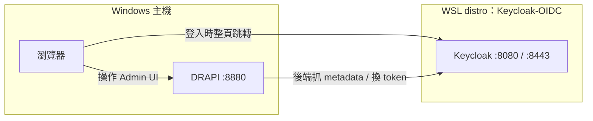

# 環境與架構

## 環境

| 項目 | 內容 |
|------|------|
| Domino server (DRAPI) | **本機 Windows**（非 WSL），`http://127.0.0.1:8880/`，**Domino 12.0.2**、DRAPI v1.1.7 |
| 瀏覽器 | 本機 Windows |
| IdP | **Keycloak 26**，裝在新建的 WSL Ubuntu distro `Keycloak-OIDC` |

## 架構與網路

**關鍵網路觀念**：WSL2 所有 distro 共用同一個輕量 VM 與 localhost。Windows 上的 DRAPI 與瀏覽器都可連到 WSL 裡的 Keycloak —— **但有個大坑**：`localhost` 在 IPv4/IPv6 行為不一致。

> ⚠️ `DRAPI → Keycloak` 這條（providerUrl）**必須用 WSL 實際 IP，不可用 localhost**
> （詳見「實作步驟」頁的踩雷點 2）。
